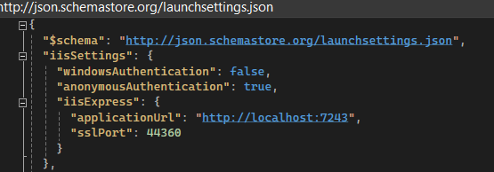
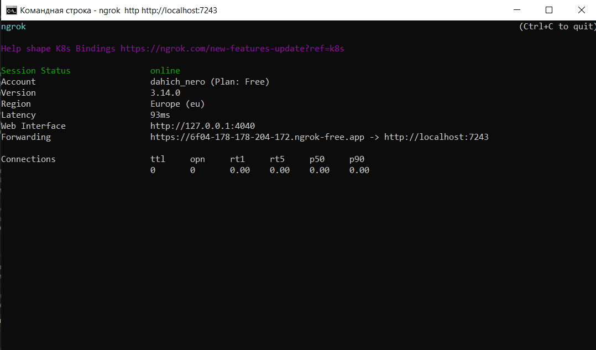
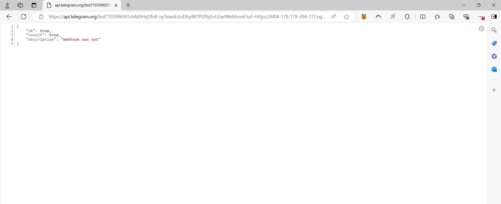

# ServicesBot
Добро пожаловать! Перед установкой программы, необходимо ознакомиться с данной инструкцией!
## WebHook
Перед запуском программы следует заранее зарегистрироваться на gnrok и установить сам исполняемый файл на официальном сайте для дальнейшего использования ngrok.
1. Заходим на сайт https://ngrok.com
2. Регистрируемся на сайте или заходим на уже существующий аккаунт.
3. Переходим а раздел Setup & Installation и устанавливаем ngrok
4. Заходим в Изменение системных переменных среды => Переменные среды => Path => Добавляем путь до исполняемого файла ngrok
5. Заходим через cmd и пишем команду ngrok config add-authtoken {ваш автотокен из раздела Setup & Installation}
## Тоннель
После проделанных действий необходимо достать webhook. Для этого:
1. в cmd пишем команду ngrok http http://localhost:7243
2. 
3. полученную ссылку из Forwarding используем для следующей ссылки: https://api.telegram.org/bot7103996505:AAE0HqDfoB-np5eaoEsLvDhydB7PGf9yEvU/setWebhook?url={yourwebhookurl}
4. 
5. Открываем ссылку и получаем следующую картину:
6. 
## Запуск приложения
*После запуска проекта необходимо вернуться к запущенной ссылке для локального соединения*
Для запуска программы пишем команду (/start).
Бот нас поприветствует и скажет написать команду /menu.
После этого бот предложит перейти в личный кабинет и посмотреть на свои подписки и сколько дней осталось.
Можем вернуться назад и перейти в Сервисы.
Выбираем из предложенного списка тот сервис, который нам по душе.
Выбираем период, который нам кажется выгодным и оптимальным.
"Оплачиваем" период.
Можем через главное меню зайти в личный кабинет и посмотреть есть ли у нас данная подписка.
Можем снова вернуться в сервисы и выбрать тот же сервис, который мы выбрали. Команда покажет нам информацию о данной подписке.
Мы можем её изменить и выбрать другой период.
После этого проверим её в личном кабинете.
Если же мы выбрали остановить подписку, то статус подписки будет остановлен.
В дальнейшем мы можем выбрать себе подписку, если захотим вернуться.

